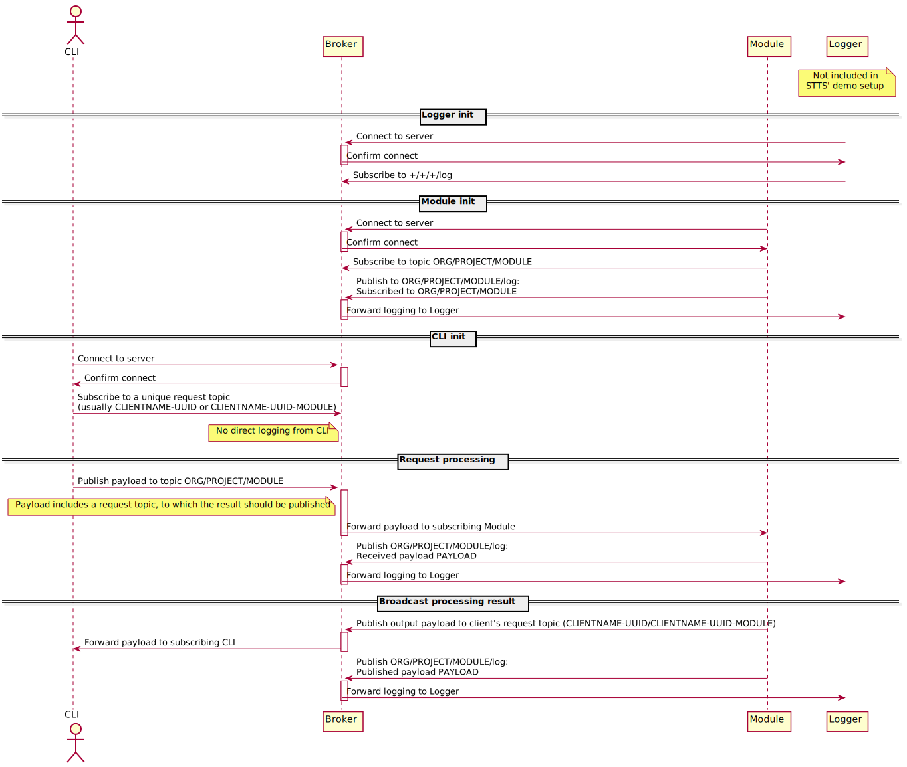

# MQTT TEST

## To set up mosquitto MQTT server locally:

    sudo apt install mosquitto
    sudo apt install mosquitto-clients

(It appears that a mosquitto daemon runs directly after install.)

## The rbnf module and CLI

To run demo module that connects to mosquitto on localhost (see -help):

### Precompiled binary:
        
    ./rbnfmodule cmd/rbnfmodule/data/*.xml 

### Running using `go run`: 

    mqtttest$ go run cmd/rbnfmodule/main.go cmd/rbnfmodule/data/*.xml 

### Connect to specific mosquitto broker:

    ./rbnfmodule -h mqtt.eclipse.org:1883 cmd/rbnfmodule/data/*xml

or

    mqtttest$ go run cmd/rbnfmodule/main.go -h mqtt.eclipse.org:1883 cmd/rbnfmodule/data/*xml

## To run client CLI that calls the above module via mosquitto on localhost (see -help):

Interactive loop, binary:

    ./rbnfcli

or using `go run`

    mqtttest$ go run cmd/rbnfcli/main.go

Single run with command line input data:

    ./rbnfcli 666 78966
     
or

    mqtttest$ go run cmd/rbnfcli/main.go 666 78966 
      
   

Use `go build` to create binaries.

### The RBNF rule files of the `data` directory are obtained from unicode.org:

         curl https://raw.githubusercontent.com/unicode-org/cldr/master/common/rb/sv.xml > sv.xml
         ...

  
## The decomp module and CLI

     ./decompmodule cmd/decompmodule/data/sv_nst.txt

     ./decompcli             // interactive

     ./decompcli  hundskatt  // single call

or

     mqtttest$ go run cmd/decompmodule/main.go  cmd/decompmodule/data/sv_nst.txt

     mqtttest$ go run cmd/decompcli/main.go     

## Bugs

If the corresponding module is not started, the CLI just hangs there. 

---------------------------------------------------------

# MQTT-protokoll

## Modul-topic

Varje modul som kan anropas som en service lyssnar på en topic med följande utseende:

    <ORGANISATION>/<PROJEKT>/<MODUL>

Tänkbara exempel:

    sbtal/longtext/lexikon
    tmh/sluddersyntes/sluddraren
    stts/textproc/rbnf

### Loggning

Loggning sker till

    <ORGANISATION>/<PROJEKT>/<MODUL>/log

(för att övervaka alla loggar, kan man prenumerera på `+/+/+/log`)

## CLIENT NAME
Varje klient som kopplar upp sig mot MQTT-brokern har ett namn som består av två delar:
`<NAMN>-<UUID>`

Namnet består av små bokstäver och inga bindestreck. 

Varje MQTT-klient måste ha ett unikt client-id.

## RESPONSE TOPIC

Varje klient som förväntar svar på ett anrop (request response) lyssnar på sitt eget `response topic`. Det kan vara 
enbart CLIENT NAME, dvs `<NAMN>-<UUID>`, eller om flera moduler anropas kan man använda `<NAMN>-<UUID>-<MODUL>` eller liknande för att få svaren separat.

Alla saker som förväntar sig svar på förfrågan (request-response) skapar ett sådant unikt topic. Ett nytt skapas för varje ny uppkoppling.

Exempel:

En klient som anropar `stts/textproc/rbnf`, prenumererar på och förväntar sig svar på sin egen topic:

       rbnfspellout-39e8fa26-f9d1-11ea-b5e1-8c89a580ea9c

(Där `rbnfspellout` är klientens namn, som inte förändras mellan uppkopplingar.)

## PAYLOAD

Det som skickas som data till MQTT-servern.

Anrop från MQTT-klienter följer ett bestämt protokoll (XML):

    response_topic:<CLIENT NAME>  // Hit skickas svar på anrop

    request_id:<ID>       // Skickas tillbaka till klienten för att den skall veta vilken "request" som besvarats

    error:<MESSAGE>       // Felmeddelanden. Skall möjligen vara struktur/objekt (XML)

    data:<"OBJEKT">       //  Struktur/objekt för data mellan moduler, enligt resp API

där `<"OBJECT">` betyder strukturerad data enligt den specifika modulens API (som XML).

Exempel på payload från "klient" som gör ett anrop till MQTT topic `stts/textproc/rbnf`:

      <spellout_payload response_topic="rbnfspellout-39e8fa26-f9d1-11ea-b5e1-8c89a580ea9c" 
                        request_id="b69c3f28-fd04-11ea-a0f6-9eb6d0d8b881" 
                        error="">
             <data ruleset="spellout-numbering" lang="sv" input="666" output=""></data>
      </spellout_payload>

## Modul-respons

När en modul svarar på ett anrop (request), skickas svaret till `response_topic` (dvs `<CLIENT NAME>`), med samma `request_id` som fanns i anropet (request).

Exempel på respons från ovanstående anrop:

      <spellout_payload response_topic="rbnfspellout-cd9f14a9-f9d1-11ea-9236-8c89a580ea9c" 
                        request_id="b69c3f28-fd04-11ea-a0f6-9eb6d0d8b881" 
                        error="">
            <data ruleset="spellout-numbering" lang="sv" input="666" output="sex­hundra­sextio­sex"></data>
      </spellout_payload>

Mottagaren håller koll på `request_id`, som kan vara ett UUID eller ett löpnummer eller något annat som går att hålla reda på. Mottagaren har en lista på `request_id`:n, och för varje svar, så plockas resp. `request_id` bort. Om det kommer fler svar med samma `request_id` för mottagaren hantera det på lämpligt vis (kasta bort, skicka felmeddelande, eller hantera flera svar om det är önskvärt).

# Problem

## Flera instanser utan att det märks

Flera instanser av "samma" modul kan startas, och alla kommer att svara på anrop till samma topic.

Någon måste övervaka att ett topic redan är upptaget av den först startade modulen med detta topic. (?)

Man kan inte veta om ett topic "finns" eller inte, eftersom man kan prenumerera på vilket topic som helst. 

Om flera moduler ger resultat för samma förfrågan, så kan man se till att man bara behandlar resultatet första gången man får ett resultat för ett visst request-id. Då tillkommer eventuellt andra problem, såsom felhantering i de fall man har en waitgroup eller mutex som väntar in att man fått alla resultat.

(Man kan tänka sig ett scenario där man _vill_ ha olika svar på samma `request_id`, men då börjar det bli rörigt.)

## Ingen instans utan att det märks

Om en modul inte är igång, kan en klient bli hängande, i väntan på ett svar, för evigt.

Bör alla moduler ha en ping, som måste besvaras inom en time-out?

# Övervakning av MQTT-broker

## mosquitto_sub

Subscribe to all calls (for monitoring and debugging):

        mosquitto_sub -h localhost -t "#" -v

## Monitor mosquitto MQTT broker

       http://mqtt-explorer.com/

Install on Ubuntu:

     sudo snap install mqtt-explorer 

----
# Links
Git/Go setup for 2fa:
https://stackoverflow.com/questions/60579900/how-to-fix-invalid-version-and-could-not-read-username-in-go-get-of-a-priv   
`go env -w GOPRIVATE=github.com/mycompany/*`

Electron - package a web application as a separate GUI:
https://en.wikipedia.org/wiki/Electron_(software_framework)
