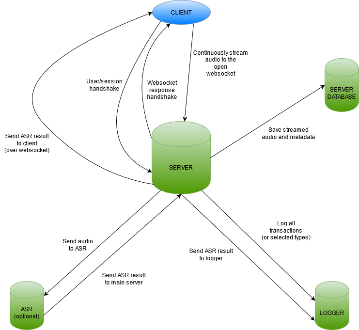

# rispik

This folder contains code and documentation for the development of a first recording tool, to be used in test recordings sessions in August, 2020.

# Description

## User Web Clients

    - HTML5 + CSS Grid, following separate layout spec.
    - Simple login: USER + SESSION
    - Session timer
    - Start/stop rec buttons
    - Audio input meter
    - Server ASR result text area, that scrolls down, pushing earlier results at bottom of list 
    - Client starts audio recording
    - Client connects to server over WebSocket
    - Client-server handshake (wearing gloves, of course)
    - Client streams audio to server over WebSocket
    - Client listens for ASR response on WebSocket
    

## CLI client
    - Stream audio (live from mic using "rec" (SoX) or from audio file) from command line to server via WebSocket
    - Read ASR result over WebSocket

## Admin client

    - Simple log page, to which server sends log messages over WebSocket
    - File listings?
    - Client listings? (See log above)

## Server

    - Serves client and admin GUI
    - Waits for WebSocket calls
    - Reads streaming audio over WebSocket
    - Saves streaming audio locally (or on remote location?)
    - Saves meta data along with audio
    - Optionally streams incoming audio stream to stand-alone ASR server
    - If streaming to ASR server, sends corresponding ASR result to user client over WebSocket
    - Keeps track of clients

## Websocket protocol

1. JSON formatted message types

       - connection/handshake request from client to server
       - connection/handshake confirmation from server to client
       - close request from client to server
       - error/warning/logging message from client to server
       - error/warning/logging message from server to client
       - keepalive(?)
 
   Suggested protocol:

       label string {handshake, close, message, keepalive} required
       level string {info, warning, error} optional
       content string {} required
  
     
2. Raw audio data     
   Streamed audio is sent "raw" -- no json or metadata, just raw bytes over an existing websocket connection.
     

## Simple flow chart

